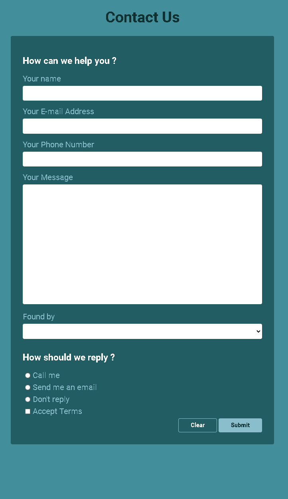
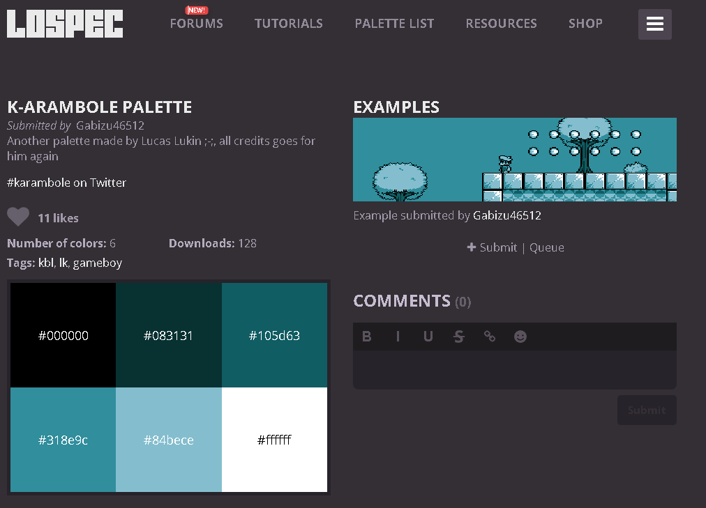

# Form-0.1

Challenge for Udemy course [100 days of code 2022 by Academind](https://www.udemy.com/course/100-days-of-code-web-development-bootcamp/)

 

## Technologies:

- [HTML](https://developer.mozilla.org/en-US/docs/Web/HTML)
- [CSS](https://developer.mozilla.org/en-US/docs/Web/CSS)
  - [CSS variables](https://developer.mozilla.org/en-US/docs/Web/CSS/--*)
  - [Flexbox](https://developer.mozilla.org/en-US/docs/Learn/CSS/CSS_layout/Flexbox)
- [Git](https://git-scm.com/)
- [Github](https://github.com/)
- [Github pages](https://pages.github.com/)
- [BEM](http://getbem.com/)

  _Note:_ <small>BEM is overkill for this small project. I used it for the sake of training.</small>

## Notes:
- Simple form using only [HTML](https://developer.mozilla.org/en-US/docs/Web/HTML) and [CSS](https://developer.mozilla.org/en-US/docs/Web/CSS)
- I am using GET request to send the user input on from submit to prevent the webpage from crashing caused by the lack of back-end service that can handle the POST request.
- The color pallete is called [k-arambole](https://lospec.com/palette-list/k-arambole).

  - **_Inspiration_**:  
    

- You can view the final version of the page [HERE](https://lifetime-days-of-code.github.io/form-0.1/)
